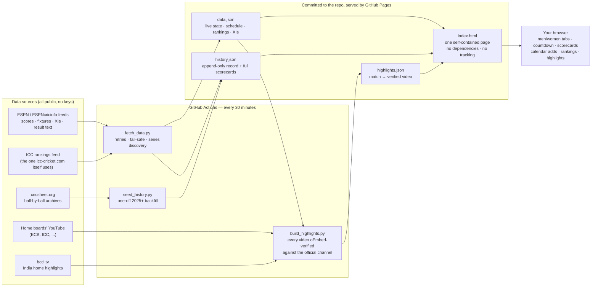

# Team India Cricket Tracker 🏏

Follow the Indian men's and women's cricket teams: what's live, what's next,
the playing XIs, and every international result of the year.

**Live site:** https://danpune.github.io/india-cricket-tracker/

- **Up next / live** — the current or next India match with a countdown
  (or live score), venue, and playing XIs once the toss is done.
- **Current tour** — every match of the series in progress, results included.
- **Coming up** — all announced future tours with dates and venues, each with
  one-tap Google Calendar / iCal adds.
- **Scorecards** — every finished match expands into the full card: who scored
  (runs and balls, not-outs, who didn't bat) and the bowling figures.
- **⭐ Following** — per-player cards merging franchise (IPL) and international
  appearances with per-match batting/bowling lines.
- **Win odds** on upcoming matches — Polymarket market prices (informational
  only, not betting advice).
- **ICC Rankings** — official team rankings per format plus the world top-10
  batters and bowlers, India highlighted.
- **Highlights** — finished matches link to official highlights: the home board's
  YouTube channel (every video oEmbed-verified) or bcci.tv for India home games.
- **Results** — two full years of the record, season by season, series by series,
  wins and losses color-coded (with 🏆 banners for the Champions Trophy, Asia Cup,
  Women's World Cup and T20 World Cup titles).

Plus an **About** tab: why the site exists, every data source, non-affiliation
and privacy statements, and a rights-holder contact route.

## How it works

- `index.html` — the whole site: one self-contained page, no dependencies,
  no cookies, no tracking.
- `fetch_data.py` — pulls from ESPN's public (unofficial) cricket feeds every
  30 minutes via GitHub Actions → `data.json` (current state) and
  `history.json` (append-only season record).
- `seed_history.py` — backfill of the match record (2025→) from
  [cricsheet.org](https://cricsheet.org).

Scores update within ~30 minutes of a match finishing. Data is unofficial and
may lag or contain errors; nothing here is affiliated with the BCCI, ICC, or ESPN.

## Architecture — how the machine runs itself

**Match-day lifecycle** — what happens without anyone touching anything:

1. **Before**: the match sits in the schedule with a countdown and 📅 calendar links.
2. **Toss**: the next cron run picks up the playing XIs from the match summary feed.
3. **During**: the hero card shows the live score (runs/wickets/overs) each half-hour.
4. **Result**: the final scorecard, result sentence and W/L color land in `history.json` —
   the permanent record grows by one match, forever.
5. **Recap**: once the home board uploads, `build_highlights.py` matches the video by
   teams + ordinal + format, verifies it belongs to the official channel, and the
   ▶ Highlights link appears.

Design principles: **fail-safe over fresh** (a bad fetch never overwrites good data),
**verify over trust** (rankings from the official feed, videos oEmbed-checked — the
`@bcci` YouTube handle is a spoof, which is why), and **facts only** (scores and
fixtures are fetched, never fabricated; unknown shows as TBA, not a guess).

## Fork it — run your own team's tracker

Everything is designed to be forked (a Pakistan, Australia or England tracker is
mostly a data change):

1. **Fork the repo**, then enable **Actions** (forks have workflows disabled by
   default — Actions tab → enable) and **Pages** (Settings → Pages → deploy from
   `main`, root).
2. **Update the hardcoded URLs** — the `og:url` / `og:image` meta tags and the
   GitHub links in `index.html` (footer + About) point at this repo; point them
   at yours.
3. **Swap the team**: `fetch_data.py` filters on team name and holds the verified
   ESPN series ids in `SERIES` (league ids are probeable — see CLAUDE.md);
   `seed_history.py` downloads that team's cricsheet archive; re-verify the
   official YouTube channels in `build_highlights.py` for your team's boards.

CLAUDE.md documents the data sources, their quirks, and every landmine we hit.

## License

Code is [MIT-licensed](LICENSE) — use it, fork it, build your own team's tracker.
Match data comes from the public sources credited above and stays subject to
their terms; cricsheet data is ODC-licensed with attribution.
